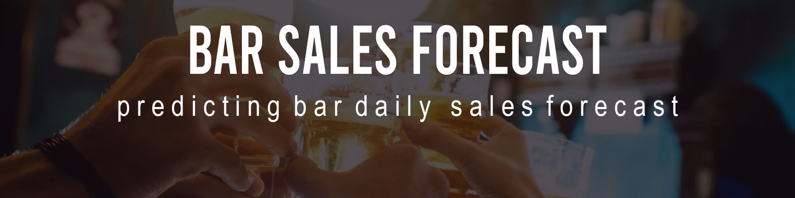
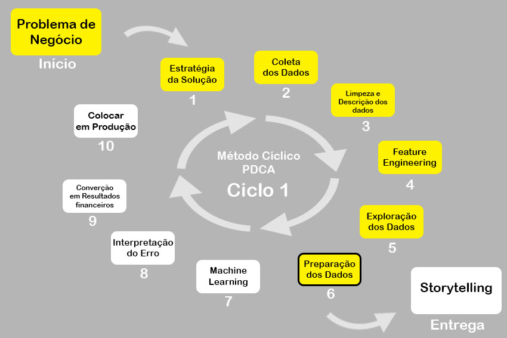

### Olá, seja bem vindo ao meu diretório. Esta página é somente um relatório do projeto, para acessar as análises na íntegra clique na pasta "notebooks" e em seguida no arquivo "notebook.ipynb" :smiley:
# Bar Sales Predict
## Bar Forecast Daily Sales

# 1.0 Problema de Negócio
O Top Bar é um Snooker Bar localizado no Brasil, no estado de São Paulo e atua no setor de bares e restaurantes. Os principais produtos/serviços do Top Snooker Bar são: aluguel de mesas de bilhar para utilização no local e venda de comidas e bebidas para consumo no local ou delivery.

A empresa conta com um time de colaboradores efetivos e freelancers, o time deve está sempre compatível com a demanda ao longo do tempo. Além dos colaboradores efetivos, o bar também contrata colaboradores freelancers, para equilibrar a forte sazonalidade semanal, típica do setor de bares. O equilíbrio entre contratação de colaboradores freelancers e a demanda, é o tema deste projeto.

Apesar da contratação de freelancers, em alguns dias, a demanda supera a disponibilidade de mão de obra. O excesso de demanda gera uma fila de entregas de produtos, principalmente na cozinha, gerando insatisfação para os clientes, perda de qualidade percebida, e além disso, parte da demanda deixa de ser suprida porque oss clientes estavam dispostos a consumir mais, portanto a empresa deixou de faturar. 

O bar recebe feedbacks de clientes sobre sua qualidade percebida através das redes sociais e outras ferramentas de qualificação interna. Com base nos feedbacks dos clientes, a administração do bar fez um estudo interno, e encomendou um projeto de Data Science para fazer predições de vendas, para fazer uma contratação mais eficiente e atender melhor a necessidade dos clientes. Foram determinadas as seguintes premissas:
* Ás sextas, sábados e vésperas de feriados, estamos com um time disponível suficiente para atender de forma satisfátória um faturamento de até 3 mil reais.
* Nos dias que restam, estamos com um time disponível para atender satisfatoriamente um faturamento de até 1 mil e 300 reais.

Através de um estudo interno, a administração deduziu que:
* Quando o faturamento supera os valores assumidos nas premissas, a empresa deixa de lucrar uma média de 600 reais, pelo não atendimento total da demanda, já abatendo o custo da mão de obra adicional.
* Por outro lado, a contratação de mão de obra ociosa, ou seja, quando contrata-se mão de obra adicional desnecessariamente, há um custo para a empresa de 300 reais.

Por motivo de sigilo, foram omitidos do dataset, 12 produtos que são considerados estratégicos para a empresa. Os faturamentos de tais produtos foram totalmente desconsiderados, os valores das premissas foram estipulados já considerando tal diferença de faturamento. Este fato pode ser totalmente ignorado para a elaboração do projeto.

A empresa Top Bar é um bar, e como todo bar, nos referimos ao valor total consumido pela mesa como "Comanda". Este termo irá se repetir bastante durante o projeto. Os dados são reais, coletados entre 05/2017 até 07/2022.

# 2.0 Estratégia da Solução
## 2.1. Objetivos:
1. Principais insights sobre as features mais importantes para o faturamento.
2. Quanto de retorno financeiro anual a empresa terá ao utilizar o modelo de predições?
3. Qual será o faturamente total semanal imediatamente seguinte ao dataset?

## 2.2 Proposta de Solução:
## 2.3 Inputs:
## 2.4 Outputs:

# 3.0 Premissas
# 4.0 Top 3 Data Insights
# 5.0 Machine Learning Model Aplicado
# 6.0 Machine Learning Model Performance
# 7.0 Resultados Financeiros
# 8.0 Conclusão
# 9.0 Aprendizados
# 10.0 Próximos Passos
# 11.0 Sumário
## 11.1 Billiard
* No: ID da mesa aberta no sistema, é a 'key' da comanda do cliente no sistema, uma vêz que a comanda se encerra, este número nunca mais se repete.
* Name: Número da mesa física no ambiente de atendimento.
* Start Time: Horário de início da abertura da comanda do cliente.
* In use: Tempo em que a comanda permaneceu aberta (tempo em uso no sistema).
* Semana: Semana relativa do mês, a semana se inicia no dia 1, independente do dia semanal.
* Turno: Os turnos são divididos em dois. 'Tarde': do início do expediente, até às 21 horas, 'Noite': das 21 horas até o término das atividades. O turno é definido de acordo com o horário de abertura da comanda.
* Total Bilhar: Total pago de bilhar por comanda.
* Pago: Valor total pago pela comanda, engloba os produtos consumidos e o aluguel do bilhar.
* Preço/Hora: Custo do bilhar por hora. O bilhar é cobrado por hora e não por partida (ficha). Os preços podem variar de acordo com dias de semana, promoções e tamanho de mesa de bilhar (A casa conta com mesas de bilhar de tamanho oficial, semi-oficial, oficial americana, e universitárias.
* Data: Data do início da abertura da comanda.
## 11.2 Sales
* Time: Horário da venda do ítem.
* Purchaser: Mesa física em que o produto foi servido.
* Item: Nome do produto
* Voucher: ID da mesa aberta no sistema, é a 'key' da comanda do cliente no sistema, uma vêz que a comanda se encerra, este número nunca mais se repete
* Name: Número da mesa física no ambiente de atendimento.
* Semana: Semana relativa do mês, a semana se inicia no dia 1, independente do dia semanal.
* Turno: Os turnos são divididos em dois. 'Tarde': do início do expediente, até às 21 horas, 'Noite': das 21 horas até o término das atividades. O turno é definido de acordo com a abertura da comanda.
* Classe 1: Classificação dos produtos segundo a sua natureza de consumo, diretamente relacionado aos setores, diferencia cozinha, bar, bilhar e etc.
* Classe 2: Classificação dos produtos de acordo com o tipo de insumo que pode ou não ser necessário para sua manipulação, útil para identificar custos diretos. Exemplo: Porções quentes quase sempre são fritas, portanto utilizam gordura vegetal para o seu processamento. Interessante para poder trabalhar melhor a gestão de custos.
* Classe 3: Classificação dos produtos de acordo com o nicho de clientes que atende, diferencia por exemplo cervejas Mainstream, Premium ou artesanais. Interessante para poder trabalhar melhor os direcionamentos de ações para melhorar as vendas.
# 12.0 Estágio do Projeto

